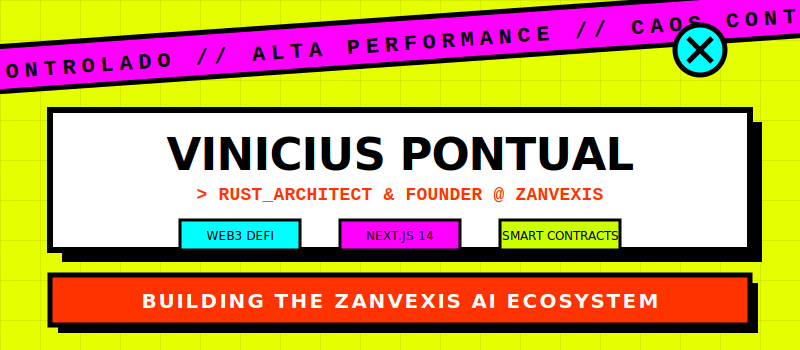

  

   
   

  <h1>Vinicius Pontual</h1>
  <h3>Arquiteto de Software & Founder</h3>

   

  

    Não apenas escrevo código; construo ecossistemas digitais seguros, rápidos e escaláveis. Minha atuação foca em unir a robustez de sistemas de baixo nível com a performance de interfaces web modernas.
  

   

  
  

### Stack Principal & Especializações

#### Rust & Sistemas de Alta Segurança
Desenvolvimento de infraestrutura onde performance e segurança são críticos. Utilizo Rust para construir backends robustos, arquitetura de microsserviços e camadas de segurança para blockchain, focando em sistemas à prova de falhas.

#### Web3, DeFi & Smart Contracts
Criação de protocolos descentralizados para a próxima geração da internet. Experiência no desenvolvimento de dApps (Aplicações Descentralizadas), mecânicas para Crypto Games e contratos inteligentes auditáveis em Solidity e Ink!.

#### Interfaces de Alta Performance
Desenvolvimento de front-ends complexos que exigem otimização extrema. Combinação do ecossistema Next.js 14 com bibliotecas de animação (Framer Motion/GSAP) para criar experiências de usuário fluidas sem sacrificar o tempo de carregamento.

### Projeto Atual: Zanvexis

Atualmente focado no desenvolvimento da **[Zanvexis](https://www.zanvexis.com)**, um sistema operacional de IA para fundadores e empresas, migrando o núcleo de processamento para Rust visando segurança e descentralização dos agentes autônomos.

### Arsenal Técnico

  

  

